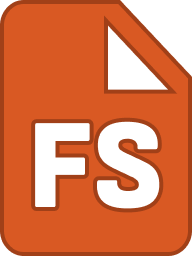

  

# FileSpark

FileSpark is an end-to-end file upload and sharing system designed around a distributed architecture.

Users can upload files directly from their desktop through a native Java client using either:

- Right-click → Upload
- Global hotkey (Ctrl + Shift + U on Windows/Linux, Cmd + Shift + U on macOS)

Files are uploaded securely to Amazon S3, and a shareable `filespark.com` link is automatically copied to the user's clipboard for instant distribution.

The system is composed of a native desktop client, a Spring Boot backend API, a React-based web application, and cloud object storage.

---

## Architecture Overview

FileSpark follows a layered architecture:

Desktop Client → Spring Boot API → MongoDB + Amazon S3  
Web Application → Spring Boot API → MongoDB + Amazon S3  

The backend is responsible for authentication, file metadata management, and generating presigned S3 URLs that allow clients to upload directly to object storage without exposing credentials.

---

## Technologies Used

  
  
  
  
  
  
  

### Desktop Client
- **Java** – Core language for native client logic
- **JavaFX** – UI framework for cross-platform desktop interface
- Native OS integrations for clipboard access and global hotkeys

### Backend
- **Spring Boot** – REST API layer and application framework
- **MongoDB** – NoSQL database for user accounts, file metadata, and cluster management
- **Amazon S3** – Scalable object storage for uploaded files
- Presigned URL workflow for secure direct-to-S3 uploads

### Web Application
- **React (TypeScript)** – Component-based frontend architecture
- **Tailwind CSS** – Utility-first styling framework for responsive UI

### Build & Dependency Management
- **Maven** – Dependency management and build lifecycle for backend services

### OPEN ISSUES
- **Graceful close on MacOS Silicon**: app won't close properly on Silicon MacOS
- **Installation for Intel Mac**: no installation available for this chip
- **No icon on Mac**: Mac version lacks the FileSpark logo
- **Easier installation on Mac**: Windows version is currently easier for users to use
